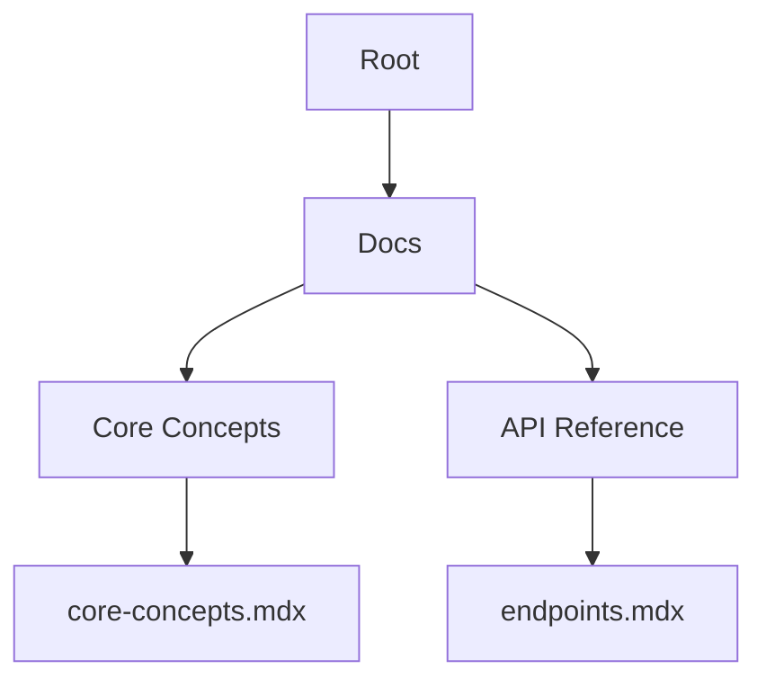

## Overview

ksm Documentation provides a robust platform for creating, organizing, and sharing technical documentation. You build structured knowledge bases using MDX pages, leverage version control for collaboration, and access powerful search tools. Core concepts include document hierarchy, team workflows, discoverability, and distribution options.

<Columns cols={3}>
  <Card title="Hierarchy" icon="layers" href="#document-organization">
    Organize content into nested structures for intuitive navigation.
  </Card>
  <Card title="Collaboration" icon="users" href="#collaboration">
    Work with teams using version control and real-time edits.
  </Card>
  <Card title="Search" icon="search" href="#search">
    Find information quickly with advanced indexing.
  </Card>
</Columns>

## Document Organization and Hierarchy

You structure your documentation using a folder-based hierarchy. Pages inherit navigation from parent directories, creating automatic sidebars and breadcrumbs.



<Callout kind="tip">
  Use YAML frontmatter in each page to set custom titles and descriptions for better SEO and navigation.
</Callout>

<Steps>
  <Step title="Create Folders" icon="folder">
    Organize content into directories like `docs/guides/` and `docs/api/`.
  </Step>
  <Step title="Add Pages" icon="file-text">
    Create MDX files with frontmatter for metadata.
  </Step>
  <Step title="Link Pages" icon="link">
    Use relative paths like `[Guides](./guides/)` for internal navigation.
  </Step>
</Steps>

Example frontmatter for a page:

````mdx
---
title: API Endpoints
description: Full reference for ksm REST API.
---
````

## Collaboration and Version Control

ksm integrates with Git for seamless collaboration. You commit changes, create pull requests, and resolve conflicts like in any repository.

<Tabs>
  <Tab title="Git Workflow" icon="git-branch">
    <Steps>
      <Step title="Branch" icon="git-branch">
        Create a feature branch: `git checkout -b feature/docs-update`
      </Step>
      <Step title="Commit" icon="git-commit">
        Add changes: `git add . && git commit -m "Add core concepts page"`
      </Step>
      <Step title="PR" icon="git-pull-request">
        Push and open a pull request for review.
      </Step>
    </Steps>
  </Tab>
  <Tab title="Real-time Edits" icon="edit-3">
    Multiple users edit simultaneously with live previews and conflict resolution.
  </Tab>
</Tabs>

<CodeGroup tabs="Bash,CLI">
```bash
git clone https://github.com/your-org/ksm-docs.git
cd ksm-docs
git checkout -b new-feature
```
```bash
ksm docs pull
ksm docs edit core-concepts.mdx
ksm docs push
```
</CodeGroup>

## Search and Accessibility Features

ksm offers full-text search across all pages, including code blocks and frontmatter. You enable accessibility with semantic headings, alt text on images, and keyboard navigation.

| Feature | Description | Benefit |
|---------|-------------|---------|
| Full-text Search | Indexes titles, content, and code | Finds exact matches in `<1s` |
| Filters | By tags, sections, or date | Narrows results quickly |
| ARIA Support | Screen reader compatible | Improves usability for all |

<Expandable title="Advanced Search Syntax" default-open="false">
  Use quotes for phrases: `"core concepts"`. Exclude terms with `-excluded`.
</Expandable>

## Export and Sharing Options

Share your docs via public links, embeds, or exports. Generate PDFs, HTML zips, or static sites.

<Callout kind="info">
  Exports preserve interactive components like tabs and steps.
</Callout>

| Format | Command | Use Case |
|--------|---------|----------|
| PDF | `ksm export pdf` | Printable guides |
| HTML Zip | `ksm export html` | Offline access |
| Embed | Share `/embed/page-slug` | Integrate in apps |

You configure exports in a `ksm.config.json` file:

```json
{
  "exports": {
    "pdf": { "theme": "blue" },
    "html": { "includeSearch": true }
  }
}
```

These concepts form the foundation of ksm. Start organizing your first hierarchy today to unlock efficient documentation workflows.